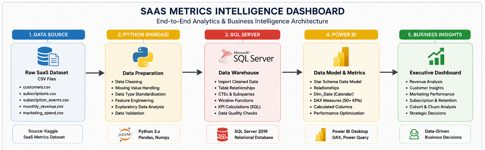
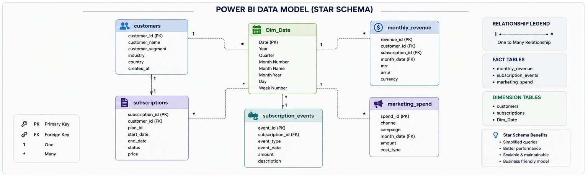

# 📊 SaaS Metrics Intelligence Dashboard

> **End-to-End SaaS Business Intelligence Solution using Python, SQL Server & Power BI**

An end-to-end analytics project that transforms raw subscription data into executive-ready business intelligence. This project simulates a B2B SaaS company's customer lifecycle, recurring revenue, subscription events, and marketing performance to help leadership monitor growth, profitability, and customer retention.


---

# 📸 Dashboard Preview

<table>
<tr>
<td align="center">

### Executive Overview


</td>

<td align="center">

### Revenue Analytics


</td>
</tr>

<tr>
<td align="center">

### Customer Analytics


</td>

<td align="center">

### Subscription Health


</td>
</tr>

<tr>
<td colspan="2" align="center">

### Marketing Analytics


</td>
</tr>
</table>

---

# 📖 Business Story

Imagine you're the Head of Revenue Operations at a growing SaaS company.

Every month you're expected to answer questions such as:

- Is Monthly Recurring Revenue growing?
- Are new customers replacing churned customers?
- Which acquisition channels generate the best ROI?
- Which pricing plans create the healthiest long-term revenue?
- Which industries and countries have the highest customer lifetime value?
- Is customer growth sustainable?

Instead of manually combining CRM exports, billing reports and marketing spreadsheets, this project consolidates all business data into a single interactive Power BI dashboard that enables executives to monitor revenue health in real time.

---

# 🎯 Business Objectives

This solution was built to answer five core business questions.

### Revenue Intelligence

- Monitor Monthly & Annual Recurring Revenue
- Track Expansion and Churn MRR
- Measure YoY Revenue Growth
- Understand pricing plan performance

---

### Customer Intelligence

- Measure customer acquisition
- Track customer lifetime value
- Analyze customer tenure
- Compare industries and company sizes

---

### Subscription Intelligence

- Monitor active subscriptions
- Measure renewal performance
- Analyze churn behavior
- Track subscription growth momentum

---

### Marketing Intelligence

- Measure Customer Acquisition Cost
- Evaluate LTV:CAC Ratio
- Monitor marketing efficiency
- Compare acquisition channels
- Analyze geographic revenue distribution

---

# 🏗️ Solution Architecture



        

---
## 🚀 Key Features

- **5-page Power BI report** with cross-filtering by Country, Industry, Year, and Plan
- **50+ validated DAX measures** across revenue, subscription, customer, and marketing domains
- **Corrected DAX logic** for previously broken/misleading measures (see [Data Quality & Fixes](#-data-quality--fixes))
- **Synthetic but realistic dataset** — 5,000 customers, 12-month history, 5 relational CSV tables
- **Full Python EDA** covering distribution checks, cohort trends, and churn/revenue correlations
- **SQL data model** with clean star-schema-style joins and explicit NULL handling
- Deliberately **corporate/light aesthetic** (rather than dark-themed) to demonstrate design range across audiences

---

# 📈 Key Business Outcomes

- Centralized SaaS KPIs into a single executive dashboard
- Reduced reliance on manual reporting by integrating five business domains
- Built reusable DAX measures for recurring revenue analysis
- Enabled drill-down analysis across Country, Industry, Pricing Plan and Time
- Demonstrated end-to-end analytics workflow from raw data to executive reporting

---

## 🧱 Tech Stack

| Layer | Tools |
|---|---|
| Data Generation & Modeling | Python (Faker/NumPy/Pandas), MS SQL Server |
| Data Cleaning & EDA | Python (Pandas, Matplotlib, Seaborn) |
| Data Transformation | Power Query (M) |
| Semantic Layer | DAX |
| Visualization | Power BI Desktop |

---

## 🗂️ Dataset

Synthetic data was generated to mimic real SaaS billing and CRM exports:

| Table | Description | Approx. Rows |
|---|---|---|
| `customers.csv` | Customer master — signup date, industry, company size, country | 5,000 |
| `subscriptions.csv` | Subscription-level records — plan, status, start/end dates | 5,000 |
| `monthly_revenue.csv` | Monthly recurring revenue transactions per customer | 68,490 |
| `marketing_spend.csv` | Monthly spend and new customers by acquisition channel | 180 |
| `subscription_events.csv` | Churn/downgrade/upgrade and subscription events with event type | 10,707 |




---

## 📈 Headline Metrics (as modeled)

**Executive Overview**
- Total MRR: **$1.5M** · ARR: **$17.6M**
- Active Customers: **5,000** · Customer Churn: **15.5%**
- Average Customer LTV: **$3,712** · Avg CAC: **$634**

**Revenue**
- MRR YoY Growth: **66.1%**
- Expansion MRR: **$146.3K** · Churned MRR: **$201.8K**

**Customers**
- New Customers: **1,734** · Avg Revenue/Customer: **$294**
- Avg Customer Tenure: **14 months**

**Subscriptions**
- Active Subscriptions: **3,374** · Renewal Rate: **84.5%**
- Net Subscription Growth: **+960**

**Marketing**
- CAC: **$634** · CAC Payback Period: **2.2 months**
- LTV:CAC and Acquisition Efficiency: **5.9x**

---

💡 Key Business Insights & Strategic Recommendations

Headline Finding: Growth Is Outrunning Retention

Revenue is growing fast (66.1% MRR YoY), but that growth is driven almost entirely by new-logo acquisition rather than expansion of the existing base. Churned MRR ($201.8K) exceeds Expansion MRR ($146.3K) — for every $1 of expansion revenue, $1.38 is lost to churn. This is confirmed independently by Net Revenue Retention sitting at 93.4%, below the 100% threshold that signals a healthy, compounding customer base.

Theme	Insight	Recommendation
Revenue & Retention	Churned MRR > Expansion MRR despite strong topline growth; NRR at 93.4%. Churn (15.5%) and renewal rate (84.5%) reconcile exactly across dashboard pages.	Shift resourcing from pure new-logo acquisition toward a dedicated expansion/customer-success motion — the existing base is shrinking faster than it's being grown.
Customer & Plan Mix	~60% of customers (2,979 of 5,000) sit on the Starter plan; only 841 are on Enterprise. Blended ARPC is $294/month.	Build a Starter → Growth upgrade path (usage-based triggers, in-app prompts). Converting even a small share of Starter accounts moves ARPC without adding CAC.
Marketing Efficiency	CAC varies ~5x by channel: Paid Search ($1.7K) and LinkedIn Ads ($2.3K) are cheapest; Referral ($8.2K) is the most expensive — the reverse of the typical pattern. LinkedIn Ads has the strongest LTV:CAC ratio despite only 17% of spend, while Paid Search absorbs 39%.	Reallocate spend incrementally from Referral toward LinkedIn Ads/Paid Search, but first audit how Referral CAC is calculated (likely referral-bonus costs fully loaded in).
Portfolio Resilience	Revenue is evenly spread across industries (Finance 19%, others 15–17%) rather than concentrated in one vertical.	No action needed — flagged as a genuine strength. Low customer concentration reduces revenue risk if any single vertical softens.
Unit Economics	CAC payback (2.2 months) is comfortably ahead of average customer tenure (14 months) — economics work today.	Monitor closely: at 15.5% churn and sub-100% NRR, the payback margin is more fragile than the headline growth number suggests if churn ticks up further.

---

## 🛠️ Data Quality & Fixes

A DAX audit surfaced two critical measure bugs that were corrected before finalizing the report:

1. **MRR inflated ~10x** — traced to a summation error double-aggregating across an unfiltered date table relationship; corrected with proper `CALCULATE` filter context.
2. **Broken MRR Growth Rate measure** — was returning static/incorrect values due to a missing time-intelligence function; rebuilt using `DIVIDE` and prior-period comparison logic to return accurate MoM/YoY growth.

The corrected, validated measures are documented in the DAX measure library included in this repo.

---

## 📁 Project Structure

```
saas-metrics-intelligence-dashboard/
├── Dataset/
│   ├── customers.csv
│   ├── subscriptions.csv
│   ├── revenue.csv
│   ├── marketing_spend.csv
│   └── churn_events.csv
├── SQL/
│   └── data_model.sql          # DDL, joins, NULL handling
├── Python/
│   └── saas_eda.py             # Exploratory data analysis
├── Power BI/
│   ├── SaaS_Metrics_Dashboard.pbix
│   └── dax_measures_library.md
├── ScreenShots/
│   ├── executive_overview.png
│   ├── revenue_analytics.png
│   ├── customer_analytics.png
│   ├── subscription_health.png
│   └── marketing_analytics.png
└── README.md
```

---

## 🔍 Exploratory Data Analysis (Python)

`saas_eda.py` covers:
- Data integrity checks (nulls, duplicates, referential consistency across tables)
- Revenue and subscription trend analysis over the 12-month window
- Churn rate breakdowns by plan, country, and industry
- Customer LTV and CAC payback distributions
- Visualizations built with Matplotlib/Seaborn to validate patterns before they were rebuilt as DAX measures in Power BI

---

## 🧮 SQL Layer

The SQL layer (MS SQL Server) handles:
- Table creation and constraints for all 5 entities
- Explicit handling of NULLs (e.g., customers with no churn date, in-progress subscriptions)
- Joins structured to support a clean star-schema import into Power BI's data model

---

## ⚙️ How to Use

1. Clone the repo
2. Load the CSVs in `/data` into SQL Server using the schema in `sql/data_model.sql`, **or** connect Power BI directly to the CSVs
3. Open `powerbi/SaaS_Metrics_Dashboard.pbix` in Power BI Desktop
4. Refresh the data source connection to point to your local files/database
5. Run `python/saas_eda.py` (requires `pandas`, `matplotlib`, `seaborn`) to reproduce the EDA notebooks/charts

---

## 🎯 Why This Project

This project was built to demonstrate practical SaaS/subscription analytics skills — the kind used to assess revenue quality, retention health, and go-to-market efficiency — using a dataset and metric set modeled closely on real B2B SaaS reporting conventions (MRR bridges, cohort churn, CAC payback, LTV:CAC).

---

## 👤 Author

**Yusuf**
Data Analyst | SQL · Power BI · Python
📧 mdyusuf911@gmail.com
💻 [github.com/Yusufmd24](https://github.com/Yusufmd24)

---

# 💼 Skills Demonstrated

- Business Intelligence
- SaaS Analytics
- Data Modeling
- SQL
- Python
- Exploratory Data Analysis
- DAX
- Power Query
- KPI Design
- Dashboard Storytelling
- Executive Reporting
- Data Visualization

---

If you found this project valuable, consider giving the repository a ⭐.

Feedback and suggestions are always welcome.
